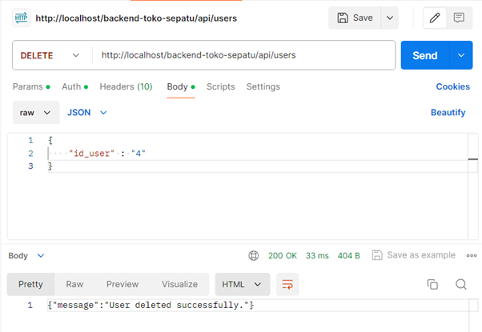
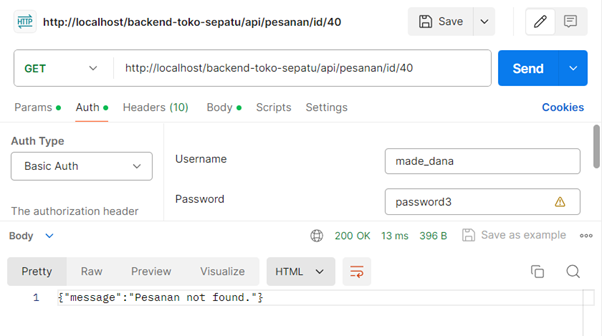

# Proyek Akhir: Sistem Backend Website Toko Sepatu

```
Nama        : I Gede Diva Ari Yuda
NIM         : 220040126
Kelas       : UG224
Mata Kuliah : Back-end Web Development
```

## Brainstorming Ide/Studi Kasus 

Saya ingin membangun sistem backend dari sebuah website sederhana untuk toko sepatu yang bertujuan untuk memudahkan pemilik dan admin toko dalam mengelola dan mempromosikan produk-produk sepatu mereka secara online. Website ini akan menjadi platform yang user-friendly bagi pengunjung untuk menjelajahi katalog sepatu yang tersedia, melihat informasi detail produk, dan menghubungi toko untuk melakukan pemesanan melalui kontak yang tertera didalam website tersebut.

### Fitur-fitur Utama:

1. Manajemen User (Pengguna) 👤
   - Website akan menyimpan informasi tentang user, termasuk role (peran) mereka sebagai 'pemilik' atau 'admin'.
   - Pemilik dan admin akan memiliki akses untuk melihat, menambahkan, mengubah, dan menghapus data pengguna.

2. Manajemen Kategori 🗂️
   - Website akan menyimpan informasi tentang kategori sepatu yang tersedia, seperti sepatu olahraga, sepatu formal, sepatu kasual, dan lain sebagainya.
   - Pemilik dan admin dapat mengelola kategori, seperti menambahkan kategori baru, mengubah nama kategori, atau menghapus kategori yang tidak lagi diperlukan.

3. Manajemen Produk 📦
   - Website akan menyimpan informasi detail tentang setiap produk sepatu, termasuk nama, deskripsi, harga, gambar, dan kategori yang terkait.
   - Pemilik dan admin dapat mengelola produk, seperti menambahkan produk baru, mengubah informasi produk, atau menghapus produk yang tidak lagi dijual.
   - Pada halaman utama website, pengunjung akan dapat melihat daftar sepatu yang tersedia.
   - Pengunjung dapat melihat sepatu berdasarkan kategori melalui menu navigasi atau filter yang disediakan.
   - Ketika pengunjung mengklik pada produk tertentu, mereka akan diarahkan ke halaman detail produk yang menampilkan informasi lengkap seperti gambar, deskripsi, dan harga.

4. Manajemen Pesanan 🛒
   - Website akan menyimpan informasi tentang pesanan yang masuk dari pelanggan, termasuk tanggal pesanan, pengguna yang menangani pesanan, produk yang dipesan, informasi pelanggan (nama, kontak), status pesanan, jumlah, dan total harga.
   - Pemilik dan admin dapat melihat dan mengelola pesanan yang masuk melalui panel admin.
   - Pengunjung dapat melihat informasi kontak toko (nomor telepon, email, alamat) untuk melakukan pemesanan melalui kontak offline dengan toko.
   - Pemilik dan admin dapat memperbarui tanggal serta status pesanan, seperti 'pending' (menunggu), 'diproses', 'dikirim', atau 'selesai', untuk memberikan informasi terkini kepada pelanggan.

5. Autentikasi dan Otorisasi (Keamanan) 🔐
   - Website akan menggunakan sistem keamanan untuk memastikan bahwa hanya pengguna yang berwenang yang dapat mengakses halaman-halaman tertentu.
   - Hanya pengguna dengan peran 'pemilik' dan 'admin' yang akan dapat mengakses fitur manajemen user, kategori, produk, dan pesanan.

Dengan fitur-fitur ini, website toko sepatu akan menjadi solusi yang efektif bagi pemilik toko untuk mengelola dan mempromosikan produk mereka secara online. Pengunjung akan mendapatkan pengalaman berbelanja yang nyaman dengan kemudahan dalam menjelajahi katalog produk dan mendapatkan informasi yang jelas tentang setiap sepatu yang ditawarkan.

Pengembangan website ini akan menggunakan pendekatan yang terstruktur dan mengikuti prinsip-prinsip pengembangan web yang baik. Dengan memisahkan bagian-bagian website menjadi komponen yang berbeda (MVC), website akan lebih mudah dikembangkan, dipelihara, dan diperbarui di masa depan. Keamanan website juga akan menjadi prioritas dengan menerapkan sistem autentikasi dan otorisasi yang tepat.

Dengan website toko sepatu ini, diharapkan pemilik toko dapat memperluas jangkauan pelanggan, meningkatkan visibilitas produk, dan memberikan pengalaman belanja dengan menggunakan aplikasi lain seperti WhatsApp untuk melakukan pemesanan yang menyenangkan bagi para penggemar sepatu.

## Skema/Gambar Tech Stack


Penjelasan Skema/gambar tech stack yang akan digunakan pada website toko sepatu:

1. **PHP** digunakan sebagai **bahasa pemrograman utama** di sisi server untuk mengolah logika bisnis terkait dengan manajemen produk, kategori, user, dan pesanan. PHP merupakan bahasa yang populer dan memiliki banyak dukungan untuk pengembangan web dinamis. Dengan PHP, kita bisa membangun RESTful API yang dapat menangani berbagai operasi seperti pengelolaan produk, kategori, users, dan pesanan.

2. **Apache** digunakan sebagai **server web** untuk menjalankan aplikasi PHP dan mengirimkan respons HTTP ke klien atau aplikasi front-end. Apache akan mendistribusikan permintaan ke skrip PHP yang relevan. Apache dikenal karena kestabilannya dan kemampuannya untuk menangani berbagai macam beban kerja. Apache menyediakan fitur-fitur seperti modul keamanan, URL rewriting, dan caching yang membantu meningkatkan performa dan keamanan aplikasi.

3. **RESTful API** dibangun menggunakan PHP untuk menyediakan antarmuka pemrograman aplikasi yang memungkinkan pertukaran data dalam format seperti JSON atau XML. API ini akan diakses oleh aplikasi front-end atau sistem lain untuk mengambil data produk, mengelola pesanan, dan melakukan operasi lainnya. RESTful API akan menyediakan endpoint untuk berbagai operasi seperti mengambil daftar produk, menambah produk baru, memperbarui informasi produk, dan menghapus produk. RESTful API memungkinkan fleksibilitas dan interoperabilitas, sehingga berbagai jenis klien (seperti aplikasi mobile atau sistem pihak ketiga) dapat berinteraksi dengan backend.

4. **MySQL** digunakan sebagai sistem manajemen basis data relasional **(RDBMS)** untuk menyimpan dan mengambil data terkait produk, kategori, pesanan, dan user yang diperlukan dalam aplikasi web toko sepatu. MySQL adalah pilihan yang populer karena kemampuannya yang kuat dalam mengelola data relasional dan dukungannya terhadap transaksi yang aman. MySQL menawarkan fitur-fitur seperti replikasi, keamanan data, dan performa tinggi yang memastikan data selalu tersedia dan aman.

## ERD Toko Sepatu


Gambar tersebut menunjukkan Entity Relationship Diagram (ERD) dari sebuah toko sepatu dengan tiga entitas utama: Kategori, Produk, dan Pesanan, serta satu entitas pendukung yaitu User. Berikut ini merupakan penjelasan relasi antar tabel dari ERD toko sepatu tersebut:

1. Relasi antara tabel Kategori dan Produk adalah one-to-many (1-N). Setiap kategori dapat memiliki banyak produk, tetapi setiap produk hanya termasuk dalam satu kategori. Hubungan ini ditunjukkan dengan foreign key ID_Kategori pada tabel Produk yang merujuk ke primary key ID_Kategori pada tabel Kategori.

2. Relasi antara tabel Produk dan Pesanan adalah one-to-many (1-N). Setiap produk dapat dipesan dalam banyak pesanan, tetapi setiap pesanan hanya terkait dengan satu produk. Hubungan ini ditunjukkan dengan foreign key ID_Produk pada tabel Pesanan yang merujuk ke primary key ID_Produk pada tabel Produk.

3. Relasi antara tabel Users dan Pesanan adalah one-to-many (1-N). Setiap user dapat menginputkan banyak pesanan, tetapi setiap pesanan hanya terkait dengan satu user. Hubungan ini ditunjukkan dengan foreign key ID_User pada tabel Pesanan yang merujuk ke primary key ID_User pada tabel User.

Atribut-atribut pada setiap tabel:

1. Tabel Kategori memiliki atribut ID_Kategori (primary key) dan Nama_Kategori.

2. Tabel Produk memiliki atribut ID_Produk (primary key), ID_Kategori (foreign key), Nama_Produk, Deskripsi, Harga, dan Gambar.

3. Tabel Pesanan memiliki atribut ID_Pesanan (primary key), ID_User (foreign key), ID_Produk (foreign key), Nama_Pelanggan, Kontak, Tanggal, Status.

4. Tabel Users memiliki atribut ID_User (primary key), Username, Password, Nama_Lengkap, Email dan Role.

Model ERD ini dirancang dengan mempertimbangkan kesederhanaan dan efisiensi dalam mengelola data toko sepatu. Dengan relasi one-to-many antara Kategori dan Produk, pengelolaan data menjadi lebih terstruktur dan mudah dilakukan. Setiap produk hanya perlu merujuk ke satu kategori, sehingga mempermudah pengelompokan dan pencarian produk berdasarkan kategorinya. Demikian pula, dengan relasi one-to-many antara Produk dan Pesanan, setiap pesanan hanya terkait dengan satu produk, sehingga memudahkan dalam melacak serta mengelola pesanan secara individual. Hal ini juga menyederhanakan proses pembelian, karena setiap pesanan hanya perlu mencatat satu produk yang dibeli. Secara keseluruhan, model ERD ini menyediakan struktur yang sederhana dan efisien untuk mengelola data toko sepatu, dengan mempertimbangkan relasi antara entitas-entitas utama seperti Kategori, Produk, Pesanan, dan Users.


## Struktur Proyek

```
backend-toko-sepatu/
│
├── config/ ⚙️
│   ├── database.php 
│   └── table.php 
│
├── controllers/ 🕹️
│   ├── KategoriController.php 
│   ├── PesananController.php 
│   ├── ProdukController.php 
│   └── UsersController.php 
│
├── middleware/ 🔧
│   ├── Authentication.php 
│   └── Router.php 
│
├── models/ 🗃️
│   ├── KategoriModel.php 
│   ├── PesananModel.php 
│   ├── ProdukModel.php 
│   └── UsersModel.php 
│
├── services/ 🛠️
│   ├── KategoriService.php 
│   ├── PesananService.php 
│   ├── ProdukService.php 
│   └── UsersService.php 
│
├── .env 🌐
├── .htaccess 🛡️
├── app.php 📝
├── db_toko_sepatu.sql 🗄️
├── License.md 🪪
├── README.md 📚
```

**Direktori config**

Direktori config adalah sebuah folder yang berisi file-file pengaturan yang dibutuhkan oleh sistem. Di dalam direktori ini, ada dua file penting yaitu database.php dan table.php.

**a) database.php**

```
<?php
class Database {
    private $host;
    private $dbname;
    private $username;
    private $password;
    private $conn;

    public function __construct()
    {
        if (!file_exists(dirname(__DIR__) . '/.env'))
        {
            die ('.env file not found!');
        }

        $line = file(dirname(__DIR__) . '/.env', FILE_IGNORE_NEW_LINES | FILE_SKIP_EMPTY_LINES);
        foreach ($line as $line)
        {
            if(strpos(trim($line), '#') === 0) continue; //Skip comments
            list($name, $value) = explode('=', $line, 2);
            $name = trim($name);
            $value = trim($value);

            if (!array_key_exists($name, $_ENV))
            {
                $_ENV[$name] = $value;
            }
        }

        $this->host=$_ENV['DB_HOST'];
        $this->dbname=$_ENV['DB_NAME'];
        $this->username=$_ENV['DB_USERNAME'];
        $this->password=$_ENV['DB_PASSWORD'];
    }

    public function getConnection()
    {
        $this->conn = null;

        try 
        {
            $this->conn = new PDO("mysql:host=" . $this->host . ";dbname=" . $this->dbname, $this->username, $this->password);
        }
        catch (PDOException $exception)
        {
            echo "Connection error: " . $exception -> getMessage();
        }

        return $this->conn;
    }

    public function __destruct()
    {
        $this->conn = null; // Close the PDO connection
    }
}
```

File **database.php** mengatur bagaimana aplikasi terhubung ke database MySQL dengan menggunakan PHP. Di dalam file ini, ada sebuah kelas yang disebut **Database**. Kelas ini bertugas mengelola koneksi ke database.

Kelas **Database** memiliki beberapa variabel privat seperti `$host`, `$dbname`, `$username`, `$password`, dan `$conn` yang digunakan untuk menyimpan informasi koneksi database. Ketika objek dari kelas ini dibuat, konstruktor `__construct()` akan membaca informasi koneksi dari file `.env`. Informasi ini kemudian disimpan dalam variabel `$_ENV`.

Untuk membuat koneksi ke database, digunakan metode **getConnection()** yang memanfaatkan PDO (PHP Data Objects). Jika ada kesalahan saat mencoba menghubungkan ke database, pesan kesalahan akan ditampilkan. Ketika objek **Database** tidak lagi digunakan, destruktor **__destruct()** akan menutup atau menghentikan koneksi ke database secara otomatis. 

**b) table.php**

File table.php berisi sebuah array (kumpulan data) yang menghubungkan nama tabel database dengan nama yang lebih mudah diingat. Dalam kasus ini, ada empat tabel yang dihubungkan:

```
<?php
return [
    'users' => 'users',
    'produk' => 'produk',
    'pesanan' => 'pesanan',
    'kategori' => 'kategori'
];
```
Penghubungan ini dapat digunakan untuk merujuk ke tabel-tabel tersebut dalam kode sistem dengan menggunakan nama yang lebih jelas dan mudah dipahami.

Dengan adanya direktori config dan file-file di dalamnya, sistem dapat mengatur koneksi database dan mengakses tabel-tabel yang diperlukan dengan lebih mudah dan teratur. Informasi koneksi database disimpan secara terpisah dalam file .env untuk keamanan dan kemudahan pengaturan.


**Direktori Controllers**

Direktori bertanggung jawab untuk menangani permintaan dari pengguna, berinteraksi dengan kelas-kelas service, dan mengembalikan respons yang sesuai. Berikut ini merupakan penjelasan untuk setiap file pada folder controller:

1\. KategoriController.php

- File ini berisi kelas KategoriController yang menangani operasi terkait kategori produk.
- Kelas ini memiliki metode untuk membaca semua kategori, membaca kategori berdasarkan ID, menambahkan kategori baru, memperbarui kategori, dan menghapus kategori.
- Setiap metode menggunakan KategoriService untuk berinteraksi dengan model dan mengakses data kategori.
- Metode-metode ini juga menggunakan Authentication middleware untuk memastikan bahwa hanya users (pengguna) dengan role (peran) 'admin' atau 'pemilik' yang dapat mengakses operasi tersebut.

2\. PesananController.php

- File ini berisi kelas PesananController yang menangani operasi terkait pesanan.
- Kelas ini memiliki metode untuk membaca semua pesanan, membaca pesanan berdasarkan ID, menambahkan pesanan baru, memperbarui pesanan, dan menghapus pesanan.
- Setiap metode menggunakan PesananService untuk berinteraksi dengan model dan mengakses data pesanan.
- Metode-metode ini juga menggunakan Authentication middleware untuk memastikan bahwa hanya users (pengguna) dengan role (peran) 'admin' atau 'pemilik' yang dapat mengakses operasi tersebut.

3\. ProdukController.php

- File ini berisi kelas ProdukController yang menangani operasi terkait produk.
- Kelas ini memiliki metode untuk membaca semua produk, membaca produk berdasarkan ID, menambahkan produk baru, memperbarui produk, dan menghapus produk.
- Setiap metode menggunakan ProdukService untuk berinteraksi dengan model dan mengakses data produk.
- Metode-metode ini juga menggunakan Authentication middleware untuk memastikan bahwa hanya users (pengguna) dengan role (peran) 'admin' atau 'pemilik' yang dapat mengakses operasi tersebut.

4\. UsersController.php

- File ini berisi kelas UsersController yang menangani operasi terkait pengguna.
- Kelas ini memiliki metode untuk membaca semua pengguna, membaca pengguna berdasarkan ID, membaca pengguna berdasarkan username, membaca pengguna berdasarkan role (peran), menambahkan users (pengguna) baru, memperbarui pengguna, menghapus pengguna, dan menangani proses login dan logout.
- Setiap metode menggunakan UsersService untuk berinteraksi dengan model dan mengakses data pengguna.
- Metode-metode ini juga menggunakan Authentication middleware untuk memastikan bahwa hanya users (pengguna) dengan role (peran) 'admin' atau 'pemilik' yang dapat mengakses operasi tersebut, kecuali untuk metode login dan logout.

Dalam setiap metode controller, data yang diterima dari permintaan (melalui URL atau body permintaan) diteruskan ke service yang sesuai untuk diproses lebih lanjut. Controller kemudian menerima respons dari service dan mengembalikannya dalam format JSON. Penggunaan Authentication middleware dalam setiap metode memastikan bahwa hanya users (pengguna) yang terotentikasi dengan role (peran) yang sesuai yang dapat mengakses operasi tertentu. Ini memberikan keamanan tambahan pada tingkat controller. Direktori "controllers" ini mengikuti prinsip Single Responsibility Principle (SRP) di mana setiap controller bertanggung jawab untuk menangani operasi yang terkait dengan entitas tertentu (kategori, pesanan, produk, users). Hal ini memudahkan pemeliharaan dan pengembangan sistem lebih lanjut.


**Direktori Middleware**

Direktori middleware menangani logika antara request HTTP yang diterima oleh aplikasi dan controller yang memproses request tersebut. Fungsi utamanya termasuk autentikasi, otorisasi, logging, dan routing.

**a) Router.php**

```
<?php

class Router
{
    private $routes = array(); // Corrected variable name from $router to $routes for consistency
    
    public function register($method, $path, $action)
    {
        $this->routes[strtoupper($method)][$path] = $action;
        return $this;
    }

    public function dispatch($method, $uri)
    {
        $basepath = dirname($_SERVER['SCRIPT_NAME']); // Remove the basepath from the URI
        if (substr($uri, 0, strlen($basepath)) == $basepath) {
            $uri = substr($uri, strlen($basepath));
        }

        $method = strtoupper($method);
        $found = false;

        if (isset($this->routes[$method])) {
            foreach ($this->routes[$method] as $route => $action) {
                $routePattern = preg_replace('/\{[^\}]+\}/', '([^/]+)', $route);
                if (preg_match('#^' . $routePattern . '$#', $uri, $matches)) {
                    array_shift($matches);
                    $params = [];
                    if (preg_match_all('/\{([^\}]+)\}/', $route, $paramNames)) {
                        foreach ($paramNames[1] as $index => $name) {
                            $params[$name] = $matches[$index];
                        }
                    }
                    $found = true;

                    // Call the action
                    $data = call_user_func($action, $params);
                    
                    error_log(print_r($data, true));
                    
                    header('Content-Type: application/json');
                    echo $data;
                    break;
                }
            }
        }

        if (!$found) {
            http_response_code(404);
            header('Content-Type: application/json');
            echo json_encode([
                'success' => false,
                'message' => 'Resource not found.'
            ]);
        }
    }
}
?>
```
Router.php bertanggung jawab untuk mengelola rute dalam aplikasi. Kelas Router memiliki properti `$routes` yang menyimpan semua rute yang terdaftar bersama dengan metode HTTP yang sesuai. Metode register digunakan untuk mendaftarkan rute baru ke dalam array `$routes`. Metode ini menerima tiga parameter:

1. `$method`, yang merupakan metode HTTP (seperti GET atau POST)

2. `$path`, yang merupakan URL rute

3. `$action`, yang merupakan fungsi yang akan dieksekusi ketika rute tersebut diakses. 

Metode dispatch bertanggung jawab untuk mengeksekusi callback yang sesuai berdasarkan metode HTTP dan URI yang diminta. Pertama, basepath dari URI dihapus. Kemudian, metode HTTP diubah menjadi huruf besar, dan variabel `$found` diatur menjadi false. Jika metode HTTP yang diminta ada dalam array `$routes`, setiap rute diperiksa apakah sesuai dengan pola URI yang diminta. Pola rute diubah sehingga parameter rute dapat dicocokkan dengan ekspresi reguler. Jika ada kecocokan, parameter diekstrak dari URI dan disimpan dalam array `$params`. Callback yang sesuai kemudian dipanggil dengan parameter tersebut, dan hasilnya dikembalikan sebagai respon JSON. Jika tidak ada rute yang cocok, kode respon HTTP 404 dikembalikan dengan pesan JSON "Resource not found."

Dengan demikian, Router.php memastikan bahwa setiap request HTTP diarahkan ke tempat yang benar berdasarkan metode HTTP dan URI yang diminta, serta mengeksekusi logika aplikasi yang sesuai dan mengembalikan respon yang diperlukan.

**b) Authentication.php**

```
<?php
class Authentication
{
    private static $conn;

    public static function setConnection($connection)
    {
        self::$conn = $connection;
    }

    public static function authenticate($requiredRoles)
    {
        if (!isset($_SERVER['PHP_AUTH_USER']) || !isset($_SERVER['PHP_AUTH_PW'])) {
            self::requireLogin();
        }

        $username = $_SERVER['PHP_AUTH_USER'];
        $password = $_SERVER['PHP_AUTH_PW'];

        // Validate the username and password from the database
        $user = self::validateUser($username, $password);

        if ($user && in_array($user['role'], $requiredRoles)) {
            $_SESSION['user'] = $user;
            return true;
        }

        // Unauthorized if user validation fails
        self::unauthorized();
    }

    private static function requireLogin()
    {
        header('WWW-Authenticate: Basic realm="My Realm"');
        header('HTTP/1.0 401 Unauthorized');
        echo json_encode(array("message" => "Login required"));
        exit();
    }

    private static function unauthorized()
    {
        header('HTTP/1.0 401 Unauthorized');
        echo json_encode(array("message" => "Unauthorized"));
        exit();
    }

    private static function validateUser($username, $password)
    {
        // Prepare and execute the query to validate the user
        $query = "SELECT * FROM Users WHERE username = :username";
        $stmt = self::$conn->prepare($query);
        $stmt->bindParam(':username', $username);
        $stmt->execute();

        $user = $stmt->fetch(PDO::FETCH_ASSOC);

        // Verify the password matches the one in the database
        if ($user && $user['password'] === $password) {
            return $user;
        }

        return null;
    }
}
?>

```

Authentication.php bertanggung jawab untuk menangani autentikasi pengguna. Kelas Authentication memiliki variable statis `$conn` untuk menyimpan koneksi database. Metode setConnection digunakan untuk mengatur koneksi database. Metode authenticate memeriksa kredensial pengguna yang dikirim melalui HTTP Basic Authentication. Jika username dan password tidak ada dalam request, metode ini memanggil requireLogin untuk meminta login. Metode validateUser memvalidasi username dan password dari database. Jika pengguna valid dan memiliki role (peran) yang diperlukan `$requiredRoles`, sesi pengguna diatur dan metode mengembalikan true. Jika validasi gagal, metode ini memanggil unauthorized untuk menandakan akses tidak sah. Metode requireLogin dan unauthorized mengatur header HTTP yang sesuai dan mengembalikan pesan JSON yang menunjukkan bahwa login diperlukan atau akses tidak sah. Dengan demikian, Authentication.php memastikan bahwa hanya users (pengguna) yang terautentikasi dan memiliki role (peran) yang sesuai yang dapat mengakses sumber daya tertentu, meningkatkan keamanan suatu sistem.


**Direktori Models**

Direktori models bertanggung jawab untuk berinteraksi dengan database dan melakukan operasi CRUD (Create, Read, Update, Delete) pada tabel-tabel yang terkait. Berikut adalah penjelasan untuk setiap file model:

1\. KategoriModel.php

- File ini berisi kelas KategoriModel yang mengatur interaksi dengan tabel kategori di database.
- Kelas ini memiliki metode untuk membaca semua kategori, membaca kategori berdasarkan ID, menambahkan kategori baru, memperbarui kategori, dan menghapus kategori.
- Koneksi database diinisialisasi dalam konstruktor kelas, dan nama tabel diambil dari file konfigurasi `config/table.php`.
- Setiap metode menggunakan prepared statement untuk menjalankan query SQL yang sesuai dan mengembalikan hasil yang diharapkan.

2\. PesananModel.php

- File ini berisi kelas PesananModel yang mengatur interaksi dengan tabel pesanan di database.
- Kelas ini memiliki metode untuk membaca semua pesanan, membaca pesanan berdasarkan ID, menambahkan pesanan baru, memperbarui pesanan, dan menghapus pesanan.
- Koneksi database diinisialisasi dalam konstruktor kelas, dan nama tabel diambil dari file konfigurasi `config/table.php`.
- Setiap metode menggunakan prepared statement untuk menjalankan query SQL yang sesuai dan mengembalikan hasil yang diharapkan.

3\. ProdukModel.php

- File ini berisi kelas ProdukModel yang mengatur interaksi dengan tabel produk di database.
- Kelas ini memiliki metode untuk membaca semua produk, membaca produk berdasarkan ID, menambahkan produk baru, memperbarui produk, dan menghapus produk.
- Koneksi database diinisialisasi dalam konstruktor kelas, dan nama tabel diambil dari file konfigurasi `config/table.php`.
- Setiap metode menggunakan prepared statement untuk menjalankan query SQL yang sesuai dan mengembalikan hasil yang diharapkan.

4\. UsersModel.php

- File ini berisi kelas UsersModel yang mengatur interaksi dengan tabel users di database.
- Kelas ini memiliki metode untuk membaca semua pengguna, membaca pengguna berdasarkan ID, membaca pengguna berdasarkan username, membaca pengguna berdasarkan peran, menambahkan pengguna baru, memperbarui pengguna, dan menghapus pengguna.
- Koneksi database diinisialisasi dalam konstruktor kelas, dan nama tabel diambil dari file konfigurasi `config/table.php`.
- Setiap metode menggunakan prepared statement untuk menjalankan query SQL yang sesuai dan mengembalikan hasil yang diharapkan.

Setiap model dalam aplikasi menggunakan PDO untuk koneksi ke database yang diatur dalam konstruktor. Nama tabel diambil dari `config/table.php` untuk fleksibilitas pengubahan. Setiap metode model menggunakan prepared statement untuk query SQL, mencegah SQL injection dan memastikan keamanan. Kesalahan query ditangkap dengan PDOException untuk pesan error. Struktur direktori `models` mengikuti Single Responsibility Principle (SRP), memisahkan tanggung jawab antar tabel untuk pemeliharaan dan pengembangan yang efisien.

**Direktori Services**

Direktori services bertanggung jawab untuk mengatur logika bisnis dan interaksi antara controller dan model. Berikut adalah penjelasan untuk setiap file service:

1\. KategoriService.php

- File ini berisi kelas KategoriService yang menangani operasi terkait kategori produk.
- Kelas ini memiliki metode untuk mengambil semua kategori, mengambil kategori berdasarkan ID, menambahkan kategori baru, memperbarui kategori, dan menghapus kategori.
- KategoriService berinteraksi dengan KategoriModel untuk mengakses data kategori dari database.

2\. PesananService.php

- File ini berisi kelas PesananService yang menangani operasi terkait pesanan.
- Kelas ini memiliki metode untuk mengambil semua pesanan, mengambil pesanan berdasarkan ID, menambahkan pesanan baru, memperbarui pesanan, dan menghapus pesanan.
- PesananService berinteraksi dengan PesananModel untuk mengakses data pesanan dari database.

3\. ProdukService.php

- File ini berisi kelas ProdukService yang menangani operasi terkait produk.
- Kelas ini memiliki metode untuk mengambil semua produk, mengambil produk berdasarkan ID, menambahkan produk baru, memperbarui produk, dan menghapus produk.
- ProdukService berinteraksi dengan ProdukModel untuk mengakses data produk dari database.

4\. UsersService.php

- File ini berisi kelas UsersService yang menangani operasi terkait pengguna.
- Kelas ini memiliki metode untuk mengambil semua pengguna, mengambil pengguna berdasarkan ID, mengambil pengguna berdasarkan username, mengambil pengguna berdasarkan peran, menambahkan pengguna baru, memperbarui pengguna, menghapus pengguna, dan menangani proses login dan logout.
- UsersService berinteraksi dengan UsersModel untuk mengakses data pengguna dari database.

Setiap kelas service menerima objek model terkait sebagai parameter konstruktor, memungkinkan interaksi dengan data model untuk operasi pengambilan dan manipulasi data. Metode-metode dalam service ini memproses data dari model sebelum mengembalikannya ke controller. Dengan memisahkan logika bisnis dari interaksi antara controller dan model, penggunaan kelas-kelas service memfasilitasi pemeliharaan, pengujian, dan pengembangan aplikasi lebih lanjut, sesuai dengan prinsip-prinsip pemisahan tanggung jawab dan modularitas.

**app.php** 

File app.php bertanggung jawab sebagai titik masuk utama dari sistem backend toko sepatu. Dalam file ini terdapat beberapa komponen penting, diantaranya adalah sebagai berikut:

- **Fungsi Utama:**

  Berperan sebagai entry point utama yang memulai sesi pengguna dan meng-include file-file yang diperlukan seperti controller, konfigurasi database, middleware Router, dan Authentication.

- **Koneksi Database:**

  Menggunakan kelas Database untuk mengelola koneksi database yang disimpan dalam variabel `$db`, serta mengatur koneksi untuk kelas Authentication menggunakan metode `setConnection()`.

- **Objek Controller:**

  Setiap entitas seperti Users, Produk, Kategori, dan Pesanan memiliki objek controller masing-masing. Objek-objek ini menerima koneksi database sebagai parameter dan bertanggung jawab atas logika bisnis terkait entitas tersebut.

- **Routing dan Dispatching:**

  Membuat objek Router untuk mengatur rute-rute aplikasi, dengan mendaftarkan rute menggunakan metode `register()` yang menghubungkan metode HTTP, path, dan aksi ke fungsi atau metode controller yang sesuai. Permintaan dari pengguna kemudian di-dispatch menggunakan metode `dispatch()` pada objek Router.

**db_toko_sepatu.sql**

File db_toko_sepatu.sql berisi definisi struktur basis data untuk sistem backend toko sepatu, yang dimana struktur basis datanya berupa tabel sebagai berikut:
- **Tabel Kategori:** Menyimpan kategori produk dengan kolom id_kategori sebagai primary key dan nama_kategori.

- **Tabel Produk:** Menyimpan informasi produk dengan kolom id_produk sebagai primary key. Kolom lainnya meliputi nama_produk, deskripsi, harga, gambar, dan id_kategori sebagai foreign key.

- **Tabel Users:** Menyimpan informasi pengguna dengan kolom id_user sebagai primary key. Kolom lainnya mencakup username, nama_lengkap, email, password, dan role.

- **Tabel Pesanan:** Menyimpan data pesanan dengan kolom id_pesanan sebagai primary key. Kolom lainnya termasuk tanggal_pesanan, id_user, id_produk, nama_pelanggan, kontak, status, jumlah, dan total_harga.

**License.md**

File License.md merupakan lisensi MIT yang memberikan izin kepada siapa pun untuk menggunakan, menyalin, memodifikasi, dan mendistribusikan perangkat lunak tanpa biaya. Meskipun lisensi ini memberikan kebebasan tersebut, tidak ada jaminan atas kualitas perangkat lunak, dan pemilik lisensi tidak bertanggung jawab atas penggunaan atau kerusakan yang mungkin timbul dari penggunaan perangkat lunak tersebut.

**README.md**

File README.md merupakan sebuah dokumen yang berisi informasi terperinci mengenai proyek sistem backend untuk toko sepatu. Dokumen ini dirancang untuk memberikan panduan yang komprehensif bagi pengguna terkait cara instalasi, struktur keseluruhan proyek, dan contoh penggunaan fungsionalitas yang tersedia. README.md bertujuan untuk memudahkan pengguna dalam memahami dan mengimplementasikan proyek ini dengan baik, sehingga dapat dimanfaatkan secara efektif sesuai dengan kebutuhan sistem backend toko sepatu yang bersangkutan.


## Petunjuk Pemasangan

Berikut merupakan petunjuk pemasangan sistem backend dari website toko sepatu ke server lokal menggunakan XAMPP:

1. Pertama, kita harus menginstall server lokal XAMPP yang mencakup Apache, PHP, dan MySQL. Jika belum, silakan download XAMPP dari situs resmi (https://www.apachefriends.org) dan install sesuai dengan petunjuk yang diberikan.
2. Setelah instalasi selesai, jalankan XAMPP Control Panel dan pastikan service Apache dan MySQL sudah aktif dengan mengklik tombol "Start" pada masing-masing service.
3. Buka folder `htdocs` pada direktori instalasi XAMPP (C:\xampp\htdocs). Folder ini akan menjadi tempat kita menyimpan proyek sistem backend dari website toko sepatu, seperti gambar dibawah ini :

4. Salin seluruh folder proyek "backend-toko-sepatu" ke dalam folder `htdocs`. Pastikanlah telah menyalin seluruh folder beserta isinya sesuai dengan Struktur Proyek yang telah dijelaskan diatas. Kita juga dapat melakukan cloning atau mengunduh repository pada link ini : https://github.com/ariyuda08/backend-toko-sepatu.git
5. Buka file `.env` pada folder proyek (backend-toko-sepatu) menggunakan editor teks dan pastikan konfigurasi database sesuai dengan nama host, database, username, dan password sebagai berikut:
```
DB_HOST = localhost
DB_NAME = toko_sepatu
DB_USERNAME = root
DB_PASSWORD =
```
6. Buka browser dan akses phpMyAdmin dengan mengetikkan "http://localhost/phpmyadmin" pada address bar. Kita akan diarahkan ke halaman phpMyAdmin yang merupakan antarmuka untuk mengelola database MySQL.
7. Di halaman phpMyAdmin, klik pada menu `Databases` di bagian atas. Kemudian, pada bagian "Create database", masukkan nama database `toko_sepatu` dan pilih collation `utf8mb4_general_ci`. Klik tombol "Create" untuk membuat database baru.


8. Setelah database berhasil dibuat, pilih database `toko_sepatu` yang baru saja dibuat dari daftar database di sebelah kiri.
9. Klik tab `Import` pada menu atas untuk beralih ke halaman impor data. Di halaman ini, Anda dapat mengimpor struktur tabel dan data awal untuk aplikasi dari file SQL yang telah disediakan.
10. Pada halaman impor, klik tombol `Choose File` dan pilih file `db_toko_sepatu.sql` yang terletak pada folder "database" dalam proyek Anda. File SQL ini berisi perintah-perintah SQL untuk membuat tabel-tabel yang diperlukan dan mengisi data awal.


11. Setelah memilih file SQL, klik tombol `Go` pada bagian bawah halaman untuk memulai proses impor. Tunggu hingga proses impor selesai. Anda akan melihat pesan sukses jika impor berhasil dilakukan.
12. Sekarang, aplikasi sudah terhubung dengan database lokal. Kita dapat mengakses aplikasi melalui browser dengan URL "http://localhost/backend-toko-sepatu/".
13. Jika semuanya berjalan dengan baik, Kita akan melihat halaman utama aplikasi toko sepatu di browser. Kita dapat mulai mengeksplorasi fitur-fitur pada sistem backend toko sepatu tersebut, seperti melihat daftar produk, mengelola kategori, mengelola pesanan, dan lain sebagainya.


14.	Jika Kita ingin menghentikan aplikasi, Kita dapat mematikan service Apache dan MySQL pada XAMPP Control Panel dengan mengklik tombol `Stop` pada masing-masing service.

## Cara Penggunaan

berikut adalah penjelasan mengenai cara penggunaan dan daftar URL untuk menguji API menggunakan aplikasi Postman berdasarkan kode pada file app.php:

1\. **Instal dan Buka Aplikasi Postman**
- Unduh dan instal aplikasi Postman pada situs resminya (https://www.postman.com/downloads/) di perangkat yang ingin digunakan untuk pengujian. 
- Buka aplikasi Postman setelah proses instalasi selesai.

2\. **Melakukan Login**


- Klik tombol `+` di sudut kanan atas untuk membuat permintaan baru.
- Pilih metode HTTP `POST` dari dropdown.
- Masukkan URL `http://localhost/backend-toko-sepatu/api/login` di kolom URL.
- Klik tab `Body` di bawah kolom URL.
- Pilih opsi `raw` dan format `JSON` dari dropdown.
- Masukkan data login dalam bentuk JSON dengan menyesuaikan pada salah satu 
- data yang di inputkan pada file db_toko_sepatu.sql pada repository, seperti dibawah ini:

```
{ 
    "username": "made_dana", 
    "password": "password3" 
}
```
- Klik tombol `Send` untuk mengirim permintaan.
- Jika berhasil, Kita akan menerima respons dengan kode status 200 dan pesan "Login successful".

3. **Melakukan Logout**


- Pilih metode HTTP `POST` dari dropdown.
- Masukkan URL ` http://localhost/backend-toko-sepatu/api/logout` di kolom URL.
- Klik tombol `Send` untuk mengirim permintaan.
- Jika berhasil, Kita akan menerima respons dengan kode status 200 dan pesan "Logout successful".

### Peringatan!!!
Sebelum melakukan pengujian pada semua URL yang berkaitan pada rute Users, Produk, Kategori, dan Pesanan. Kita harus melakukan Autentikasi terlebih dahulu kecuali pada bagian Login dan Logout tidak di perlukan Autentikasi, yaitu dengan mengikuti langkah-langkah sebagai berikut :


- Klik tab `Auth` di bawah kolom URL.
- Pada keterangan Auth Type pilihlah tipe “Basic Auth” dari dropdown.
- Masukkan Username dan Password dengan menyesuaikan pada salah satu data yang di inputkan pada file db_toko_sepatu.sql pada repository, seperti gambar diatas.

4\. **Uji Rute Users**

- **Melihat/mendapatkan semua data Users/pengguna:**
    
    - Pilih metode HTTP `GET` 
     - Masukkan URL http://localhost/backend-toko-sepatu/api/users 
     - Klik `Send` untuk mengirim permintaan

- **Melihat/mendapatkan data Users/pengguna berdasarkan ID:**
    
    - Pilih metode HTTP `GET`
    - Masukkan URL http://localhost/backend-toko-sepatu/api/users/id/1 (ganti `1` dengan ID pengguna yang Kita inginkan selama datanya ada pada database)
    - Klik `Send` untuk mengirim permintaan

- **Melihat/mendapatkan data Users/pengguna berdasarkan username:**
    
    - Pilih metode HTTP `GET`
    - Masukkan URL http://localhost/backend-toko-sepatu/api/users/username/yuda_diva (ganti `admin` dengan username yang Kita inginkan selama datanya ada pada database)
    - Klik `Send` untuk mengirim permintaan

- **Melihat/mendapatkan Users/pengguna berdasarkan role:**

    - Pilih metode HTTP `GET`
    - Masukkan URL http://localhost/backend-toko-sepatu/api/users/role/admin (ganti `admin` dengan role yang Anda inginkan selama datanya ada pada database)
    - Klik `Send` untuk mengirim permintaan

- **Menambahkan Users/pengguna baru:**

    - Pilih metode HTTP `POST`
     - Masukkan URL http://localhost/backend-toko-sepatu/api/users 
     - Buka tab `Body`, pilih opsi `raw` dan format `JSON`
     - Masukkan data pengguna baru dalam bentuk JSON, misalnya sebagai berikut :
    ```
    {
        "username": "ketut_garing",
        "nama_lengkap": "ketut garing",
        "email": "ketutgaring@email.com",
        "password": "password4",
        "role": "admin"
    }
    ```
     - Klik `Send` untuk mengirim permintaan

- **Memperbarui data Users/pengguna:**

     - Pilih metode HTTP `PUT`
     - Masukkan URL http://localhost/backend-toko-sepatu/api/users 
     - Buka tab `Body`, pilih opsi `raw` dan format `JSON`
     - Masukkan data pengguna yang diperbarui dalam bentuk JSON, misalnya sebagai berikut : 
    ```
    {
        "id_user" : "4",
        "username": "ketut_gering",
        "nama_lengkap": "ketut gering",
        "email": "ketutgering@email.com",
        "password": "password4",
        "role": "admin"
    }
    ```
     - Klik `Send` untuk mengirim permintaan

- **Menghapus data Users/pengguna:**

     - Pilih metode HTTP `DELETE`
     - Masukkan URL http://localhost/backend-toko-sepatu/api/users 
     - Buka tab `Body`, pilih opsi `raw` dan format `JSON`
     - Masukkan ID pengguna yang ingin dihapus dalam bentuk JSON, misalnya sebagai berikut :
    ```
    {
        "id_user" : "4"
    }
    ```
     - Klik `Send` untuk mengirim permintaan

5\. **Uji Rute Produk**
   
- **Melihat/mendapatkan data semua produk:**

    - Pilih metode HTTP `GET`
     - Masukkan URL http://localhost/backend-toko-sepatu/api/produk 
     - Klik `Send` untuk mengirim permintaan

- **Melihat/mendapatkan data produk berdasarkan ID:**

    - Pilih metode HTTP `GET` 
     - Masukkan URL http://localhost/backend-toko-sepatu/api/produk/id/1 (ganti 1 dengan ID produk yang kita inginkan selama datanya ada pada database)
     - Klik `Send`untuk mengirim permintaan

- **Menambahkan produk baru:**

    - Pilih metode HTTP `POST`
     - Masukkan URL http://localhost/backend-toko-sepatu/api/produk 
     - Buka tab `Body`, pilih `raw` dan `JSON`
     - Masukkan data JSON produk baru, misalnya sebagai berikut : 
     ```
     {
        "nama_produk": "Nike Jordan Low Blue",
        "deskripsi": "Sneakers klasik Keren dan Kece Badai",
        "harga": "1200.00",
        "gambar": "nike_air_force_low_blue.jpg",
        "id_kategori": 1
    }
    ```
    - Klik `Send` untuk mengirim permintaan
- **Memperbarui data Produk:**

    - Pilih metode `PUT`
    - Masukkan URL http://localhost/backend-toko-sepatu/api/produk 
    - Buka tab `Body`, pilih `raw` dan `JSON` 
    - Masukkan data JSON produk terupdate, misalnya sebagai berikut : 
    ```
    {
        "id_produk": "13",
        "nama_produk": "Nike Jordan Low Blue",
        "deskripsi": "Sneakers Kece Badai Anti Minder",
        "harga": "3200.00",
        "gambar": "nike_air_force_low_blue.jpg",
        "id_kategori": 1
    }
    ```
     
     - Klik `Send` untuk mengirim permintaan

- **Menghapus data Produk:**

    

    - Pilih metode HTTP `DELETE`
    - Masukkan URL http://localhost/backend-toko-sepatu/api/produk 
    - Buka tab `Body`, pilih `raw` dan `JSON`
    - Masukkan data JSON ID produk, misalnya sebagai berikut :
    ```
    {
        "id_produk": "13",
    }
    ```
    - Klik `Send` untuk mengirim permintaan

5\. **Uji Rute Kategori**

- **Melihat/mendapatkan semua data Kategori:**

    - Pilih metode HTTP `GET`
    - Masukkan URL http://localhost/backend-toko-sepatu/api/kategori 
    - Klik `Send` untuk mengirim permintaan

- **Melihat/mendapatkan data Kategori berdasarkan ID:**

    - Pilih metode HTTP `GET`
    - Masukkan URL http://localhost/backend-toko-sepatu/api/kategori/id/1  (ganti 1 dengan ID kategori yang kita inginkan selama datanya ada pada database)
    - Klik `Send` untuk mengirim permintaan

- **Menambahkan Kategori baru:**

    - Pilih metode HTTP `POST` 
    - Masukkan URL http://localhost/backend-toko-sepatu/api/kategori 
    - Buka tab `Body`, pilih `raw` dan `JSON`
    - Masukkan data JSON kategori baru, misalnya sebagai berikut : 
    ```
    {
        "nama_kategori":"Flat Shoes"
    }
    ```
    - Klik `Send` untuk mengirim permintaan

- **Memperbarui data Kategori:**

    - Pilih metode HTTP `PUT`
    - Masukkan URL http://localhost/backend-toko-sepatu/api/kategori
    - Buka tab `Body`, pilih `raw` dan `JSON`
    - Masukkan data JSON kategori terupdate, misalnya sebagai berikut : 
    ```
    {
        "id_kategori": "6",
        "nama_kategori": "Flat Shoes Women"
    }
    ```
    - Klik `Send` untuk mengirim permintaan

- **Menghapus data Kategori:**

    - Pilih metode HTTP `DELETE`
    - Masukkan URL http://localhost/backend-toko-sepatu/api/kategori
    - Buka tab `Body`, pilih `raw` dan `JSON` 
    - Masukkan data JSON ID kategori, misalnya sebagai berikut : 
    ```
    {
        "id_kategori": "6"
    }
    ```
    - Klik `Send` untuk mengirim permintaan

6\. **Uji Rute Pesanan**

- **Melihat/mendapatkan semua data Pesanan:**

    - Pilih metode HTTP `GET`
    - Masukkan URL http://localhost/backend-toko-sepatu/api/pesanan
    - Klik `Send`untuk mengirim permintaan

- **Melihat/mendapatkan pesanan berdasarkan ID:**

    - Pilih metode HTTP `GET`
    - Masukkan URL http://localhost/backend-toko-sepatu/api/pesanan/id/1 (ganti 1 dengan ID pesanan yang kita inginkan selama datanya ada pada database)
    - Klik `Send` untuk mengirim permintaan

- **Menambahkan Pesanan baru:**

    - Pilih metode HTTP `POST`
    - Masukkan URL http://localhost/backend-toko-sepatu/api/pesanan 
    - Buka tab `Body`, pilih `raw` dan `JSON`
    - Masukkan data JSON pesanan, misalnya sebagai berikut : 
    ```
    {
        "tanggal_pesanan": "2024-06-21 19:40:00",
        "id_user": "2",
        "id_produk": "1",
        "nama_pelanggan": "Kak Gem",
        "kontak": "081222000111",
        "status": "selesai",
        "jumlah": 2,
        "total_harga": "2400.00"
    }
    ```
    - Klik `Send` untuk mengirim permintaan

- **Memperbarui data Pesanan:**

    - Pilih metode HTTP `PUT`
    - Masukkan URL `http://localhost/backend-toko-sepatu/api/pesanan
    - Buka tab `Body`, pilih `raw` dan `JSON`
    - Masukkan data JSON pesanan terupdate, misalnya sebagai berikut : 
    ```
    {
        "id_kategori": "6",
        "nama_kategori": "Flat Shoes Women"
    }
    ```
    - Klik `Send` untuk mengirim permintaan

- **Menghapus data Pesanan:**

    

    - Pilih metode HTTP `DELETE`
    - Masukkan URL http://localhost/backend-toko-sepatu/api/pesanan
    - Buka tab `Body`, pilih `raw` dan `JSON` 
    - Masukkan data JSON ID Pesanan, misalnya sebagai berikut :
    ```
    {
        "id_pesanan": "13"
    }
    ```
    - Klik `Send` untuk mengirim permintaan

Berikut ini adalah tampilan beberapa kesalahan atau error yang terjadi jika kita belum melakukan Autentikasi atau sudah melakukan Autentikasi, tetapi salah menginputkan Username atau Password ketika hendak mengakses data pada Users, Produk, Kategori, dan Pesanan. 

- Kondisi ketika tidak melakukan Autentikasi terlebih dahulu, pada kasus ini saya ingin mendapatkan data Users, dan tidak mengaktifkan Autentikasi sehingga Kita akan menerima respons dengan kode status “401 Unathorized” serta pesan "Login required".


- Berikut ini adalah kondisi dimana saya salah menginputkan passwordnya yang menyebabkan kegagalan untuk mendapatkan data dari Produk.


Ada juga kesalahan ketika menginputkan ID yang tidak ada pada salah satu data tersebut, seperti contoh dibawah ini :

- Berikut ini adalah contoh dimana ketika kita ingin mengakses data Pesanan dengan id 40, namun id tersebut tidak ada pada data sehingga akan memberikan respon berupa pesan “Pesanan not found”.



## Refleksi Diri

Tantangan dan Kesulitan yang saya hadapi sebagai Refleksi Diri terhadap proyek sistem backend menggunakan bahasa pemrograman PHP dari website Toko Sepatu adalah sebagai berikut:


- Menentukan Fitur pada Business Logic (Logika Bisnis)

Salah satu tantangan utama dalam membangun sistem backend untuk website Toko Sepatu adalah menentukan fitur-fitur yang ada pada bisnis logika dari sistem tersebut. Hal ini melibatkan proses analisis kebutuhan yang cermat untuk memahami alur kerja, proses bisnis, dan persyaratan fungsional yang diperlukan oleh toko sepatu.

Dalam kasus ini, saya perlu mempertimbangkan berbagai aspek seperti manajemen pengguna, manajemen kategori produk, manajemen produk itu sendiri, manajemen pesanan, serta sistem autentikasi dan otorisasi untuk memastikan keamanan data dan akses yang tepat.

#### Cara Mengatasinya:

Untuk mengatasi tantangan ini, saya melakukan analisis secara mandiri terhadap kebutuhan bisnis dan fitur-fitur yang umum digunakan dalam sistem toko online. Saya mempelajari dari referensi dan contoh kasus sejenis untuk mendapatkan inspirasi dan memahami fitur-fitur yang relevan, termasuk mencari referensi di beberapa sumber di internet dan platform YouTube.

Setelah melakukan analisis, saya merancang sendiri diagram entitas hubungan (ERD) dan Skema/Gambar Tech Stack untuk mendokumentasikan fitur-fitur yang akan diimplementasikan dalam sistem backend Toko Sepatu. Proses ini dilakukan secara mandiri dan berdasarkan pemahaman saya terhadap kebutuhan bisnis

- Mengimplementasikan Autentikasi Basic Auth

Tantangan lain yang saya hadapi adalah mengimplementasikan sistem autentikasi Basic Auth yang memerlukan Users (pengguna) untuk memasukkan username dan password sebelum dapat mengakses data. Hal ini penting untuk memastikan keamanan data dan membatasi akses hanya pada pengguna yang berwenang.

Dalam kasus ini, saya perlu memastikan bahwa autentikasi Basic Auth terintegrasi dengan baik dengan sistem manajemen pengguna dan role (peran) yang dimiliki oleh pengguna. Hanya pemilik dan admin yang memiliki hak akses terhadap fitur-fitur dan data yang ada di dalam sistem.

#### Cara Mengatasinya:
Untuk mengatasi tantangan ini, saya mempelajari dan memahami konsep autentikasi dan otorisasi dalam pengembangan web, khususnya dalam bahasa pemrograman PHP. Saya mengimplementasikan autentikasi Basic Auth secara manual menggunakan menggunakan code yang sederhana.

Saya merancang dan mengimplementasikan mekanisme penyimpanan dan validasi kredensial pengguna (username dan password) dengan aman, seperti menggunakan teknik hashing dan enkripsi yang tepat. Implementasi ini dapat dilihat pada file Authentication.php yang saya sediakan pada repository backend-toko-sepatu, di mana terdapat metode validateUser yang melakukan validasi username dan password terhadap data pengguna yang disimpan dalam database.

Selanjutnya, saya mengintegrasikan sistem autentikasi Basic Auth ke dalam kontroller UsersController.php, ProdukController.php, KategoriController.php, dan PesananController.php. Dalam file ini, saya memanggil metode `Authentication::authenticate` sebelum mengakses atau memodifikasi data users (pengguna), produk, kategori, dan pesanan. Metode ini memastikan bahwa hanya pengguna dengan role (peran) yang valid yang dapat mengakses fitur-fitur tertentu dalam sistem. Dengan cara ini, saya dapat mengimplementasikan fitur autentikasi Basic Auth yang solid dan terintegrasi dengan baik dalam sistem backend website Toko Sepatu tanpa menggunakan library atau framework pihak ketiga.

- Penggunaan GitHub

Sebagai pemula, saya kesulitan memahami dan menggunakan GitHub secara efektif. Konsep-konsep seperti repository, branching, dan pull requests masih membingungkan.

#### Cara Mengatasinya:

1. Mempelajari dokumentasi resmi di website GitHub, termasuk "GitHub Guides" dan GitHub Learning Lab.
2. Menonton tutorial di YouTube dari channel freeCodeCamp.org, fokus pada konsep dasar dan tips praktis.
3. Mempraktikkan langsung dengan membuat repository.

Pendekatan ini membantu meningkatkan pemahaman dan kepercayaan diri saya dalam menggunakan GitHub, meskipun masih banyak yang perlu dipelajari.

## Penutup

Terima kasih kepada Bapak I Nyoman Rudy Hendrawan, S.Kom., M.Kom atas bimbingannya dalam mata kuliah Back-end Web Development. Maaf atas kekurangan dalam pengerjaan proyek ini. Tantangan dalam menentukan fitur logika bisnis, implementasi autentikasi Basic Auth, serta penggunaan github telah  memberikan pembelajaran berharga. Saya berkomitmen untuk terus meningkatkan keterampilan dan pemahaman dalam pengembangan web backend. Pengalaman ini sangat bermanfaat untuk pengembangan karir saya ke depannya. Terima kasih atas kesabaran dan ilmu yang telah diberikan😇🙏.